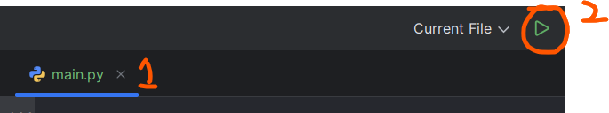
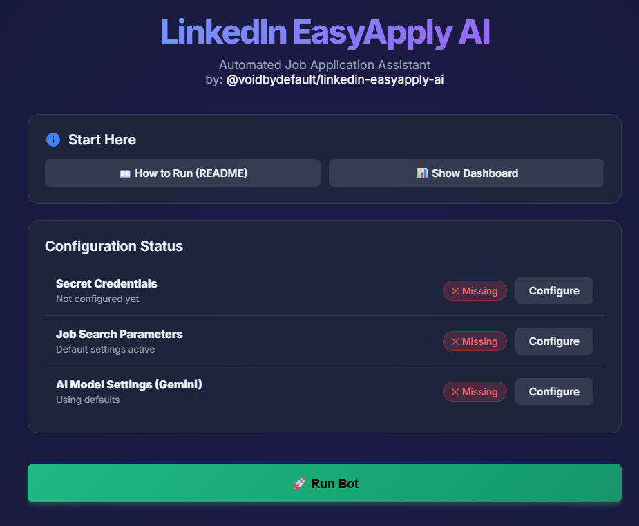

# AI-Powered LinkedIn Job Search & Application Assistant
By [voidbydefault](https://github.com/voidbydefault)

This project is an advanced automation tool designed to streamline the LinkedIn job application process. It utilizes **Selenium** for browser automation and **Google Gemini AI** to intelligently parse job descriptions, score relevance, and generate context-aware answers to application questions.

## Features

> **Major Update:** Bot is now fully GUI based. No more worrying about managing text-based configurations.

-   **AI-Driven Application:** Uses Google Gemini (Flash model) to evaluate job descriptions against your resume and generate custom answers for specific employer questions.
    
-   **Resume Parsing:** Automatically extracts professional details from PDF resumes to build a "Source of Truth" user profile.
    
-   **Intelligent Filtering:** Scores jobs based on compatibility (0-100) and skips low-relevance positions.
    
-   **Anti-Detection Mechanisms:** Implements `undetected-chromedriver`, random delays, and human-like interactions to minimize detection risk.
    
-   **Analytics Dashboard:** Built-in Streamlit dashboard to visualize application success rates, status breakdowns, and geographic data.
    
-   **Ban-Safe Mode:** Enforces daily application limits to protect account integrity.


<p align="center">
   
</p>


## Architecture

## Prerequisites

-   **Python:** 3.13+
    
-   **Google Chrome:** Installed locally.
    
-   **Gemini API Key:** Obtained from [Google AI Studio](https://aistudio.google.com/ "null").
    

## Installation

### Demo

Watch demo and how-to setup video on [YouTube](https://www.youtube.com/watch?v=7CMfvZG772k).

Prefer using PyCharm IDE for simpler setup:  

1. **Download PyCharm IDE**
   
   Download and install from [Jetbrains](https://www.jetbrains.com/pycharm/download/).

2. **Add New Python Interpreter**

   <br>
   
   <br><br>

3. **Configure Virtual Environment**

   Select "Generate New", type **Virtualenv**, and click **OK**.

   <br>
   
   <br><br>

4. **Install Dependencies**

   Double click `run.py` to open it. When you see the notification bar (as shown below), click on **`sync`**.

   <br>
   
   <br><br>

### Running the Bot

1. **Initialize the Script**

   Execute the `run.py` script.

   <br>
   
   <br><br>

2. **Complete Configuration**

   Once the Google Chrome window appears, use the GUI to complete the setup.

   <br>
   
   <br><br>

## Project Structure

```

├── requirements.txt         # Must-Be-Installed dependencies
├── run.py                   # Entry point: Initializes configuration & launcher
├── app/                     # Main Application Logic
│   ├── ai_handler.py        # AI Core: Gemini integration, Resume parsing
│   ├── config_ui.py         # Configuration Server (Flask)
│   ├── dashboard.py         # Main Analytics Dashboard
│   ├── scout_dashboard.py   # Scout Mode Dashboard
│   ├── defaults.py          # Default AI Rules and Seeds
│   ├── bot/                 # Browser Automation Logic
│   ├── static/              # CSS & Images for UI
│   └── templates/           # HTML Templates for UI
├── config/                  # Configuration Files
│   ├── config.yaml          # Job search parameters
│   ├── secrets.yaml         # Credentials (NEVER SHARE)
│   └── gemini_config.yaml   # AI settings (NEVER SHARE)
├── work/                    # Runtime Data (Logs, Databases, Cache, Resumes)
└── docs/                    # Documentation Assets
```

## Disclaimer

This code comes with no warranties at all, don't blame me if your account is restricted or banned. Keep bot's use fair and reasonable. **Don't abuse LinkedIn as a platform or this bot as a tool.**

## Credits and history

**AI-version [Linkedin EasyApply AI](https://github.com/voidbydefault/linkedin-easyapply-ai):**

Complete revamp, additional of GUI, and modularization of logics, codebase, enhanced human-like behavior and implementation of GenAI by [voidbydefault](https://github.com/voidbydefault)


**Non-AI version [EasyAplyBot](https://github.com/voidbydefault/EasyApplyBot/):**
- Grandfather, original developer: [Nathan Duma](https://github.com/NathanDuma)
- Foster dads, maintenance and improvements after Nathan left: [Micheal Dingess](https://github.com/madingess/) and [voidbydefault](https://github.com/voidbydefault/)


## Star History

[](https://www.star-history.com/#voidbydefault/linkedin-easyapply-ai&type=timeline&legend=top-left)