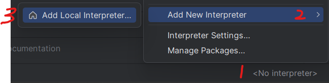
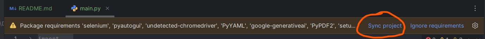
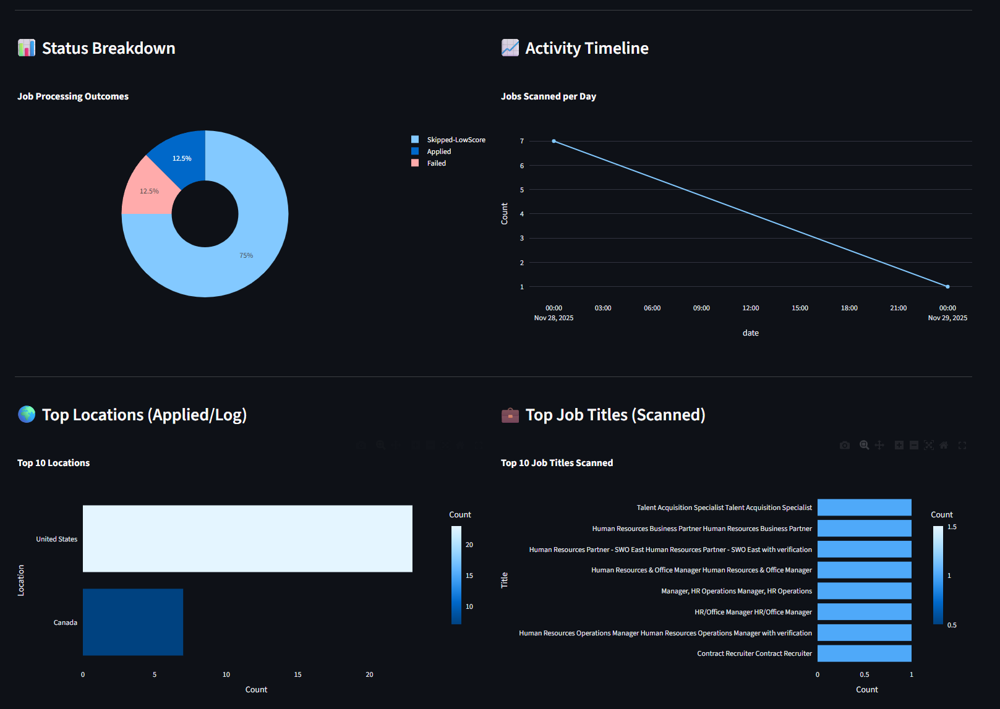

# AI-Powered LinkedIn Automation Bot
By [voidbydefault](https://github.com/voidbydefault)

This project is an advanced automation tool designed to streamline the LinkedIn job application process. It utilizes **Selenium** for browser automation and **Google Gemini AI** to intelligently parse job descriptions, score relevance, and generate context-aware answers to application questions.

## Features

-   **AI-Driven Application:** Uses Google Gemini (Flash model) to evaluate job descriptions against your resume and generate custom answers for specific employer questions.
    
-   **Resume Parsing:** Automatically extracts professional details from PDF resumes to build a "Source of Truth" user profile.
    
-   **Intelligent Filtering:** Scores jobs based on compatibility (0-100) and skips low-relevance positions.
    
-   **Anti-Detection Mechanisms:** Implements `undetected-chromedriver`, random delays, and human-like interactions to minimize detection risk.
    
-   **Analytics Dashboard:** Built-in Streamlit dashboard to visualize application success rates, status breakdowns, and geographic data.
    
-   **Ban-Safe Mode:** Enforces daily application limits to protect account integrity.
    

## Architecture

## Prerequisites

-   **Python:** 3.13+
    
-   **Google Chrome:** Installed locally.
    
-   **Gemini API Key:** Obtained from [Google AI Studio](https://aistudio.google.com/ "null").
    

## Installation

### Demo

Watch my demo and how-to setup video on [YouTube](https://youtu.be/xzHfvU5ioxM?si=CYDZCNP3wT_oBYlG).

Prefer using PyCharm IDE for simpler setup:  

1. Download and install PyCharm IDE from [Jetbrains](https://www.jetbrains.com/pycharm/download/ "null").


2. Add new Python interpreter  

        


3. Select "Generate New", type Virtualenv, and click OK

    


3.  Install dependencies:

    Double click `main.py` and once you see this notification, click on `sync`.
    
    
    

## Configuration

The bot requires user to setup three configuration files. Setup is simple, just follow the comments  (note: do not upload these files)

### 1. `secrets.yaml`

This file stores log-in credentials and personal information of user.

```
email: "your_email@gmail.com"
password: "your_linkedin_password"
personalInfo:
  First Name: "John"
  Last Name: "Doe"
  Mobile Phone Number: "1234567890"
  Phone Country Code: "United States (+1)" # Must match exactly LinkedIn dropdown 
  # ... more
```

### 2. `config.yaml`

This file is used to defines job search parameters and filters for bot's use:

```
remote:
experienceLevel:
jobTypes:
positions:
locations:
uploads:
  # ... and more
```

### 3. `gemini_config.yaml`

User **must** add own API key obtained from Google AI Studio: **always keep your API key private**

```
gemini_api_key: "YOUR_API_KEY"
model_name: "gemini-2.5-flash"
ai_settings:
  application_match_threshold: 70
  max_applications: 50
  ban_safe: True
  # ... more
```

## Usage

### Running the Bot

Execute the `main.py` script to initialize. The bot will launch a Chrome instance, generate/load your profile, and begin applying.


_Note: The first run will generate `work/user_profile.txt` based on your resume._ Later runs will ask user either to regenerate or use previously generated profiles. User may press `enter` key to accept defaults

### Running the Dashboard

Open `show_dashboard.py` and click on run icon to launch the analytics dashboard to analyze and fine-tune bot's performance:



## Project Structure

```
├── requirements.txt         # Must-Be-Installed dependencies required by the bot
├── main.py                  # Main script user need to run
├── bot_flowchart.html       # Overview of bot's workflow
├── ai_handler.py            # Gemini API integration and prompt logic
├── linkedineasyapply.py     # Selenium automation logic
├── dashboard.py             # Streamlit visualization application
├── show_dashboard.py        # Launcher for the dashboard
├── config.yaml              # Search parameters
├── secrets.yaml             # Credentials (NEVER SHARE YOUR VERSION WITH PERSONAL INFO)
├── gemini_config.yaml       # AI settings (NEVER UPLOAD YOUR API KEY)
├── chrome_bot               # Chrome directory created by bot (delete when switching account)
└── work/                    # Bot's working directory (delete to reset user profile and stats)
    ├── job_history.db       # SQLite database of scanned jobs
    ├── application_log.csv  # CSV log of applications
    └── user_profile.txt     # AI-generated candidate profile
```

## Disclaimer

This code comes with no warranties at all, don't blame me if your account is restricted or banned. Keep bot's use fair and reasonable. **Don't abuse LinkedIn as a platform or this bot as a tool.**

## Credits and history

**AI-version [Linkedin EasyApply AI](https://github.com/voidbydefault/linkedin-easyapply-ai):**

Complete revamp and modularization of logics, codebase, enhanced human-like behavior and implementation of GenAI by [voidbydefault](https://github.com/voidbydefault)


**Non-AI version [EasyAplyBot](https://github.com/voidbydefault/EasyApplyBot/):**
- Grandfather, original developer: [Nathan Duma](https://github.com/NathanDuma)
- Foster dads, maintenance and improvements after Nathan left: [Micheal Dingess](https://github.com/madingess/) and [voidbydefault](https://github.com/voidbydefault/)


## Star History

[](https://www.star-history.com/#voidbydefault/linkedin-easyapply-ai&type=timeline&legend=top-left)